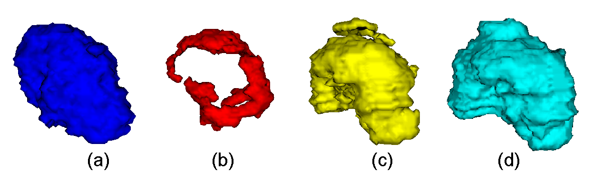

# Demo
## Abstract

 Brain tumors can present morphological changes depending on their degree of malignancy. The objective of this work is to develop a
		computational system that analyzes morphological changes and texture in order to classify the degree of malignancy of brain
		tumors from magnetic resonance imaging. This system can represent a support tool for the non-invasive diagnosis of patients with brain
		tumors. It is proposed to identify these morphological changes through the measurement of compactness, area of enclosing surface and volume. We proposed a variant to extract isolated texture descriptors, based on the co-occurrence matrix from the region of interest on different magnetic resonance image modalities. Finally we use as the magnetic resonance images with presence of gliomas with a high and low degree of malignancy for two of the most implemented methods of artificial intelligence: Support Vector Machine and a 3D Convolutional Neuronal Network, in order to evaluate the system.

Get the data from:
https://drive.google.com/drive/folders/1tM7COIzYB94pH-20PwF7sduMHkPg7QgQ?usp=sharing

After you download add the folder LGG and HGG create a folder with the name Data and add inside the folfer, the folders HGG LGG

    

